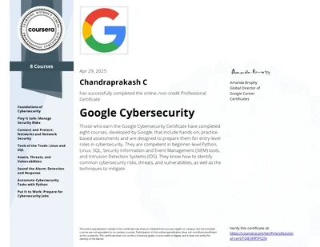
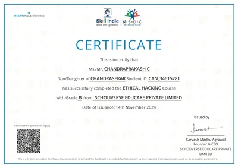

<h1 align="center">🚀 Chandraprakash C | Cybersecurity Portfolio</h1>
<p align="center">
  <b>Security Analyst | SOC Enthusiast | BSc CS Student</b><br/>
  <i>"Securing digital systems through continuous learning and practical application."</i>
</p>


## 🌐 My Portfolio Website
🔗 [Visit My Portfolio](https://chandruthehacker.github.io)

<br>

<p align="center">
  <a href="https://chandruthehacker.github.io" target="_blank">Portfolio</a> •
  <a href="https://linkedin.com/in/chandruthehacker" target="_blank">LinkedIn</a> •
  <a href="https://medium.com/@chandruthehacker" target="_blank">Blogs</a> •
  <a href="mailto:chandrupersonal@gmail.com">Contact</a>
</p>


<br>


## 📌 Professional Overview
Cybersecurity student with hands-on experience in security monitoring, log analysis, and threat detection. Currently developing SOC-relevant skills including Splunk, SIEM technologies, and incident response procedures. Passionate about blue team operations with a strong foundation in networking and system security.

<br>
<br>

## 🛠️ Technical Skills

### 🔍 Security Domains
- **Security Monitoring**: SIEM (Splunk), Log Analysis, Threat Detection
- **Incident Response**: Basic Forensics, Alert Triage
- **Network Security**: Wireshark, Zeek, Suricata, IDS/IPS concepts
- **System Hardening**: Linux/Windows security basics

### 💻 Tools & Technologies
<p align="left">
  
  
  
  
  
  
</p>

<br>
<br>


## 🛡️ Cybersecurity Journey

```plaintext
📘 11th Standard — Sparked interest in cybersecurity
🎯 College — Started building foundational skills (Networking, Cybersecurity Basics)
💡 Projects — Created real-world simulations (honeypots, AI phishing detector, etc.)
🧪 Practice — Solving TryHackMe & HTB rooms
📚 Learning — Splunk, ELK Stack, SOC workflow
🚀 Goal — Become a Tier 1/2 SOC Analyst after graduation
```

<br>
<br>


## 🚀 Key Projects

### 🐍 [Log Analysis Tool](https://github.com/chandruthehacker/log-parser)
- Python script to parse and analyze security logs
- Features pattern detection and basic anomaly alerts
- Outputs summarized reports for quick triage

### 🛡️ [Phishing Email Detector](https://github.com/chandruthehacker/phishing-email-detector)
- Analyzes email headers for suspicious patterns
- Implements basic machine learning classification
- Scores emails based on phishing indicators

### 🐝 [Honeypot System](https://github.com/chandruthehacker/honeypot)
- Low-interaction honeypot capturing attack patterns
- Integrated with alerting system
- Logs attacker techniques for analysis

---

<br><br>

## 📜 Certificates

<p align="center">
  <a href="https://www.coursera.org/account/accomplishments/professional-cert/TGJE3FRTFS2N" target="_blank">
    
  </a>

  <a href="https://trainings.internshala.com/certificate/view/nsdc/1gvfiyruzvc/fj2c4mq927_/" target="_blank">
    
  </a>

  <a href="https://www.udemy.com/certificate/UC-d1611f48-8dbb-4c43-9bde-9c0bfd0cf47c/" target="_blank">
    
  </a>
</p>


<br><br>

## 📚 Education
**B.Sc Computer Science**  
GTN Arts College, Dindigul • 2023-2026 (Expected)  
- Relevant coursework: Network Security, Operating Systems, Data Structures


<br><br>

## 📬 Contact


---

<p align="center">  </p> <p align="center"> <i>“Stay curious, stay secure.”</i> 🔐 </p>
  
